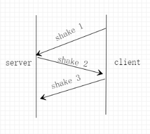

# 3-1 基于UDP协议的面向连接的可靠数据传输

>  1811464 郑佶

## 通信参数设置

### `socket`参数设置

本实验由于是基于`UDP协议`的数据传输,因此套接字的传输方式的参数设置为`无保障的传输形式`.

协议参数设置为`0`,即指该传输方式下的默认协议`UDP(用户数据报协议)`.

地址族参数设置为`AF_INET`,即指明本实验使用`IPV4`地址.

### 服务端`sockaddr`参数设置

服务端程序和客户端程序中的服务器端口号并不做限制,仅要求端口号一致.

服务端程序和客户端程序中的服务器地址族参数设置为`AF_INET`,即指明本实验使用`IPV4`地址.同`socket`的地址族参数.

服务端程序和客户端程序中的服务器`IPV4`地址指定为`127.0.0.1`,特指服务器地址为本机`IP`.

## 功能实现

### 可靠连接的建立和断开

为了通过`UDP`模拟`TCP`可靠连接的模式,本实验需要实现三次`shake(握手)`,两次`wave(挥手)`.



连接建立的简单流程如上图.三次握手过程中的服务端和客户端的状态转换依赖于有限状态自动机理论.具体的状态转换过程如下:

- 服务端程序启动时,进入等待接收shake-1数据包的状态.
- 若此时服务端接收到错误数据包或超时未收到数据包,则刷新状态,重新进入等待接收shake-1数据包的状态.
  
- 若此时服务器接收到正确的shake-1数据包,则发送shake-2数据包(此后见下文)
  
- 客户端程序启动时,客户端在确认了目标发送文件存在后,发出shake-1数据包.客户端进入等待接收shake-2数据包的状态.

  - 若此时客户端收到错误数据包或超时未收到数据包,则刷新状态,重新发送shake-1数据包,进入等待接收shake-2数据包的状态.
  - 若此时客户端接收到正确的shake-2数据包,则立即发送shake-3数据包,客户端结束握手环节

    

- 服务端在发送shake-2数据包后,进入等待接收shake-3数据包的状态.

  - 若此时客户端超时未收到数据包,则刷新状态,重新发送shake-2数据包,进入等待接收shake-3数据包的状态.
  - 若此时客户端接收到正确的shake-1数据包,则刷新状态,重新发送shake-2数据包,进入等待接收shake-3数据包的状态.
  - 若此时客户端接收到正确的shake-3数据包,服务端结束握手环节.

经过以上的三次握手的流程,服务端和客户端均进入数据传输的状态,连接建立完成.

当数据传输完成后,程序进入断开连接过程.


断开建立的简单流程如上图.两次挥手过程中的服务端和客户端的状态转换同样依赖于有限状态自动机理论.具体的状态转换过程如下:

- 断开连接请求由客户端发起,客户端发出wave-1数据包,进入等待wave-2数据包的状态
  - 若此时客户端收到错误数据包或超时未收到数据包,则刷新状态,重新发送wave-1数据包,进入等待接收wave-2数据包的状态.
  - 若收到正确的wave-2数据包,客户端结束挥手环节,退出程序

- 服务端接收完数据后进入等待接收wave-1数据包的状态.
  - 若此时客户端收到错误数据包或超时未收到数据包,则刷新状态,进入等待接收wave-1数据包的状态.
  - 若收到正确的wave-1数据包,则发送wave-2数据包,服务端结束挥手环节,退出程序

经过以上的两次挥手的流程,服务端和客户端断开连接,程序退出.

### 差错检验

在上述信息数据包(例如shake和wave数据包)和目标文件数据包的传输过程中,数据包的错误与否依赖于差错检验的函数,即校验和函数.

校验和函数如下

```c++
unsigned char check_sum(char *check_start,int check_len)
{
	if (check_len == 0)return ~(0);
	unsigned char check_value = check_start[0];
	for (int i = 1; i < check_len; i++) 
	{
        unsigned int temp_sum = check_value + (unsigned char) check_start[i];
        temp_sum = temp_sum / (1 << 8) + temp_sum % (1 << 8);
        temp_sum = temp_sum / (1 << 8) + temp_sum % (1 << 8);
        check_value = temp_sum;
    }
    return ~check_value;
}
```

该函数通过将除校验和外所有数据的内容,切分为成8-bit为单位,逐位求和并取反,即可求出校验位.

而通过将包含校验和在内的所有数据的内容,逐位求和并取反,必得0.因此校验和得0则指明数据包未受损.

因此,校验和函数在所有char型变量数组构成的数据包中,均存储为第一个`char`型数据.当校验和外的数据均填充完毕后,计算校验和并填充在数据包首位.

在接收方在校验数据包时,只需要得出整个数据包的校验和为0即可完成验证.

### 确认重传

所谓确认重传,指的是在接受目标文件(例如挥手阶段的`wave-2`数据包)超时或接收到`NAK`数据包(无差错)的情况下,重新传输数据包.

确认过程中,对于数据包校验,使用校验和函数;而对于数据包接收时间限制,使用固定值`TIMEOUT`(单位毫秒)和`C++`的`time`库的`time()`函数取当前时间并求时间差来实现.

```c++
while(1)
{
	char tmp[2];
	tmp[1] = FIRST_WAVE;
	tmp[0] = check_sum(tmp + 1,1);
	sendto(client, tmp, 2, 0, (sockaddr *) &server_addr, sizeof(server_addr));
	int begin = clock();
	char recv[2];
	int len = sizeof(client_addr);
	int fail = 0;
	while(recvfrom(client,recv,2,0,(sockaddr*)&server_addr,&len)==SOCKET_ERROR)
	{
		if (clock() - begin > TIMEOUT) 
		{
            fail = 1;
            break;
        }
	}
	if(fail == 0 && check_sum(recv,2) == 0 && recv[1] == SECOND_WAVE)
	{
        break;
	}
}
```

两次挥手中的客户端代码如上,应用了确认重传的思想.

在上图中客户端向服务端发送`wave-1`数据包后进入等待接受`wave-2`数据包的状态.当接收时间超过给定限度`TIMEOUT`或是接收数据包错误的话,都会进入下一轮循环,重发数据包.

### 停等机制

所谓停等机制,就是在文件传输过程中,每发一个文件数据包分组,均在收到确认后再发下一个文件数据包分组.


停等机制简单过程如上,一般的,都是在接收到错误数据包后重传,正确数据包后开始传输下一个数据包.

此外,停等机制可以看作是`滑动窗口机制`在窗口大小等于1时的特定情况.(滑动窗口机制见3-2实验报告)

```c++
while(1)
{
	if(send_ok == num)
		break;
	if(list.size() < WINDOW_MAXSIZE && send != num)
	{
		bag_send(storage+send*MAXLEN,send==num-1?
                 len-(num -1)*MAXLEN:
                 MAXLEN,next%((int) UCHAR_MAX + 1),send==num-1);
		list.push(bag_elem(next % ((int) UCHAR_MAX + 1)));
		bag_is_ok[next % ((int) UCHAR_MAX + 1)] = 1;
		next++;
		send++;
	}
	char recv[3];
	int len_tmp = sizeof(server_addr);
	if(
	recvfrom(client,recv,3,0,	(sockaddr*)&server_addr,&len_tmp)!=SOCKET_ERROR&&
	check_sum(recv,3)==0&&recv[1]==ACK&&
	bag_is_ok[(unsigned char)recv[2]]) 
	{
		while (list.front().order != (unsigned char) recv[2]) 
		{
			send_ok++;
            base++;
            bag_is_ok[list.front().order] = 0;
            list.pop();
        }
        bag_is_ok[list.front().order] = 0;
        send_ok++;
        base++;
        list.pop();
    }
}
```

以上是传输文件过程中停等机制的实现(实际也是滑动窗口机制),其中,窗口大小限制为1即可.

