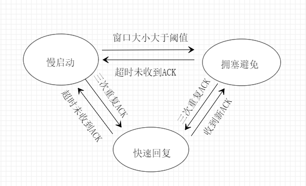

# 3-3 实现拥塞控制算法的可靠数据传输(基于3-2)

> 1811464 郑佶

## 通信参数设置

见实验3-1 3-2报告

## 功能实现

### 滑动窗口基础上拥塞控制算法的实现

本次实验将拥塞控制算法和实验3-2中的滑动窗口机制包装在函数`cwnd_send`函数中.

#### 拥塞控制的原理

目前,拥塞控制普遍使用`RENO`算法来实现.拥塞控制本质上是使用有限状态自动机来实现对传输速率的控制.拥塞控制机制所依赖的有限状态自动机有三个状态,分别是慢启动、拥塞避免、快速恢复.



如上图,表明了RENO算法自动机的三种状态的基本转换条件.

在慢启动阶段,拥塞窗口CWND的窗口大小从最小值开始快速增加到阈值;在拥塞避免阶段,CWND的大小从阈值开始呈缓慢增加到发生拥塞;在快速恢复阶段,CWND窗口大小又从阈值的一半开始快速增加到超时重置为慢启动状态或恢复非拥塞状态.

#### 代码层面上的实现

##### 变量含义

`base`:当前窗口最左端的包序号.

`send_ok`:当前窗口最左端元素的前一个元素包序号,即被认为传输完成的最后一个包.

`send`:当前窗口最右端元素的包序号.

`next`:当前窗口最右端元素的下一个元素的包序号.

`last_pack`:上一个完成接受的包序号,用于与当前接收的包序号进行比对以判断是否收到重复ACK

`dupACK`:收到的重复ACK的数量,当从其他状态进入快速恢复状态时会清零.

`CWND`:拥塞窗口的大小

`SSTH`:拥塞窗口大小的阈值

`MAXLEN`:一个数据包的大小

##### 状态迁移实现逻辑

在代码实现中,判断目前的状态的依据是`dupACK`的值和`CWND`与阈值`SSTH`之间的大小关系.

在具体的代码实现中,有限状态自动机的状态的转换和保持依赖于`dupACK`的值与当前收到的`ACK`的情况.收取`ACK`包的情况分为非重复`ACK`包,超时,以及重复`ACK`包.

在不同的状态下,收到非重复`ACK`的情况下`CWND`的增长速度不同.

- 在慢启动状态和快速恢复状态下,增长公式为`CWND=CWND+MAXLEN`.

- 在拥塞避免状态下,增长公式为`CWND=CWND+MAXLEN*(MAXLEN/CWND)`.

在不同的状态下,超时未收到合法`ACK`的状态迁移方式均相同.

- 在慢启动状态、快速恢复状态以及拥塞避免状态下,均转换进入慢启动状态,且阈值减半,窗口大小缩小为`MAXLEN`

在不同的`dupACK`的值的情况下,收到重复`ACK`包的状态迁移方式不同.

- 在`dupACK==3`的情况下,转换进入快速恢复状态,且`dupACK`清零,阈值减半,窗口大小缩小为`SSTH+3*MAXLEN`,

- 在`dupACK!=3`的情况下,均不转换状态,仅自增`dupACK`

##### 滑动窗口实现逻辑(同3-2)

- 检查窗口大小,右端不到末尾且窗口大小未满,则滑动窗口向右扩展.
  - 窗口拓展即指将`next`指代元素推入队列
- 组装数据包(即在数据内容前加上包序号/包结束信号/校验和).
- 发送滑动窗口队列`list`中数据包
- 循环接收`ACK`数据包,接收顺序从窗口首部开始按序号依序进行.被成功接受的`ACK`数据包对应的`bag_elem`型变量,依次从队列`list`中被弹出.
- 循环

##### 具体代码(`cwnd_send`函数)

```c++
void cwnd_send(char* message, int len) 
{
	queue<bag_elem> list;
	static int base = 1;
	int next = base;
	int num = len / MAXLEN + (len % MAXLEN != 0);
	int send = 0;
	int send_ok = 0;
	int last_pack = 0;
	int client_addr_len = sizeof(client_addr);
    while (1) 
	{
		if (send_ok== num)
			break;
		if (CWND < SSTH && dupACK < 3)
		{
			if (list.size() * MAXLEN < CWND && send < num)
			{
				int tmp;
				if(send==num-1)
					tmp=len % MAXLEN;
				else tmp=MAXLEN;
				bag_send(message + send * MAXLEN, tmp, next % 256, send == num - 1);
				list.push(bag_elem(clock(), next % 256));
				bag_is_ok[next % 256] = 1;
				next++;
				send++;
			}
			char recv[3];
			int recvsize = recvfrom(client, recv, 3, 0, (sockaddr*)&server_addr, &client_addr_len);
			if (recvsize && check_sum(recv, 3) == 0 && recv[1] == ACK && bag_is_ok[(unsigned char)recv[2]]) 
			{
				while (list.front().order != (unsigned char)recv[2]) 
				{
					base++;
					send_ok++;
					bag_is_ok[list.front().order] = 0;
					list.pop();
				}
				base++;
				send_ok++;
				bag_is_ok[list.front().order] = 0;
				list.pop();
				CWND += MAXLEN;
				dupACK = 0;
			}
			else 
			{
				if (last_pack==(unsigned char)recv[2]) 
				{
					dupACK++;
					if (dupACK == 3) 
					{
						SSTH = CWND / 2;
						CWND = SSTH + 3 * MAXLEN;
						next = base;
						send -= list.size();
						while (list.size() != 0)
							list.pop();	
					}
					last_pack = (unsigned char)recv[2];
				}
					if (clock() - list.front().time > TIMEOUT) 
					{
						next = base;
						send -= list.size();
						while (list.size() != 0)
							list.pop();
						SSTH = CWND / 2;
						CWND = MAXLEN;
						dupACK = 0;
					}
			}
		}

		else if (CWND >= SSTH && dupACK<3) 
		{
			if (list.size()*MAXLEN < CWND && send < num) 
			{
				int tmp;
				if(send==num-1)
					tmp=len % MAXLEN;
				else tmp=MAXLEN;
				bag_send(message + send * MAXLEN, tmp, next % 256, send == num - 1);
				list.push(bag_elem(clock(), next % 256));
				bag_is_ok[next % 256] = 1;
				next++;
				send++;
			}
			char recv[3];
			bool recvsec = recvfrom(client, recv, 3, 0, (sockaddr*)&server_addr,&client_addr_len);
			if (recvsec && check_sum(recv, 3) == 0 && recv[1] == ACK && bag_is_ok[(unsigned char)recv[2]]) 
			{
				while (list.front().order != (unsigned char)recv[2]) 
				{
					base++;
					send_ok++;
					bag_is_ok[list.front().order] = 0;
					list.pop();
				}
				base++;
				send_ok++;
				bag_is_ok[list.front().order] = 0;
				list.pop();
				CWND += MAXLEN * (MAXLEN / CWND);
				dupACK = 0;
			}
			else 
			{
				if (last_pack==(unsigned char)recv[2]) 
				{
					dupACK++;
					if (dupACK == 3) 
					{
						SSTH = CWND / 2;
						CWND = SSTH + 3 * MAXLEN;
						next = base;
						send -= list.size();
						while (list.size() != 0)
							list.pop();
					}
					last_pack = (unsigned char)recv[2];
				}
					
				if (clock() - list.front().time > TIMEOUT) 
				{
					next = base;
					send -= list.size();
					while (list.size() != 0)
						list.pop();
					SSTH = CWND / 2;
					CWND = MAXLEN;
					dupACK = 0;
				}
			}
		}
		else if (dupACK==3) 
		{	
			if (list.size() * MAXLEN < CWND && send < num) 
			{
				int tmp;
				if(send==num-1)
					tmp=len % MAXLEN;
				else tmp=MAXLEN;
				bag_send(message + send * MAXLEN, tmp, next % 256, send == num - 1);
				list.push(bag_elem(clock(), next % 256));
				bag_is_ok[next % 256] = 1;
				next++;
				send++;
			}
			char recv[3];
			bool recvsec = recvfrom(client, recv, 3, 0, (sockaddr*)&server_addr, &client_addr_len);
			if (recvsec && check_sum(recv, 3) == 0 && recv[1] == ACK && bag_is_ok[(unsigned char)recv[2]]) 
			{
				while (list.front().order != (unsigned char)recv[2]) 
				{
					base++;
					send_ok++;
					bag_is_ok[list.front().order] = 0;
					list.pop();
				}
				base++;
				send_ok++;
				bag_is_ok[list.front().order] = 0;
				list.pop();
				CWND = SSTH;
				dupACK = 0;
			}
			else 
			{
				if (last_pack == (unsigned char)recv[2]) 
				{
					CWND += MAXLEN;
					last_pack = (unsigned char)recv[2];
				}
				if (clock() - list.front().time > TIMEOUT) 
				{
					next = base;
					send -= list.size();
					while (list.size() != 0)
						list.pop();
					SSTH = CWND / 2;
					CWND = MAXLEN;
					dupACK = 0;
				}
			}
		}
	}
}
```

