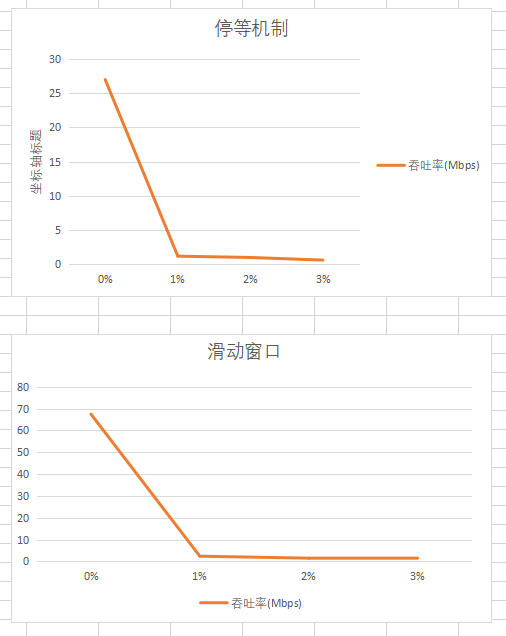
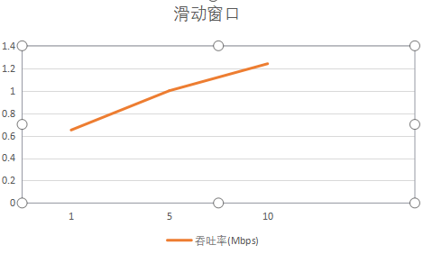
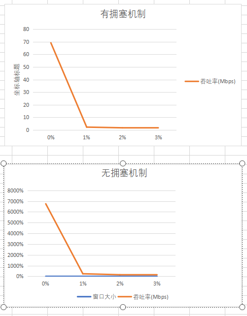

# 3-4 可靠数据传输算法的性能比对实验(基于3-1,2,3)

> 1811464 郑佶


## 停等机制与滑动窗口性能比较

### 性能数据

| 机制                   | 丢包率 | 延迟时间(ms) | 吞吐率(Mbps) | 时延(ms) |
| ---------------------- | ------ | -------- | -------- | ---- |
| 停等机制               | 0%     | 0      | 27 | 545 |
| 停等机制               | 0%     | 1      | 2.39 | 6210 |
| 停等机制               | 0%     | 2      | 1.92 | 7725 |
| 停等机制               | 0%     | 3      | 1.37 | 10850 |
| 停等机制               | 1%     | 0      | 1.16 | 12845 |
| 停等机制 | 2% | 0 | 0.97 | 18646 |
| 停等机制 | 3% | 0 | 0.58 | 25478 |
| 停等机制 | 1% | 1 | 0.65 | 22957 |
| 滑动窗口(窗口大小为10) | 0%     | 0      | 67.5 | 220 |
| 滑动窗口(窗口大小为10) | 0%    | 1     | 4.59 | 3240 |
| 滑动窗口(窗口大小为10) | 0%    | 2     | 4.00 | 3724 |
| 滑动窗口(窗口大小为10) | 0%     | 3    | 2.60 | 5710 |
| 滑动窗口(窗口大小为10) | 1%    | 0     | 2.40 | 6810 |
| 滑动窗口(窗口大小为10) | 2% | 0 | 1.49 | 9944 |
| 滑动窗口(窗口大小为10) | 3% | 0 | 1.14 | 13000 |
| 滑动窗口(窗口大小为10) | 1% | 1 | 1.24 | 11945 |

### 图形结果

以下是在延迟时间为0ms的情况下,停等机制和滑动窗口机制下各丢包率的吞吐率



### 数据分析

从性能数据来看,滑动窗口机制下吞吐率大于停等机制.这说明滑动窗口机制对性能的确有巨大提升

## 滑动窗口机制中不同窗口大小性能比较

### 性能数据(丢包率 1%,延迟1ms)

| 窗口大小  | 吞吐率(Mbps) | 时延(ms) |
| --------- | ------------ | -------- |
| 10*MAXLEN | 1.24         | 11945    |
| 5*MAXLEN  | 1.00         | 14755    |
| 1*MAXLEN  | 0.65         | 22957    |

- 上图中`MAXLEN`指代一个数据包的最大字节数(不含数据包的头)

### 图形结果

以下是在丢包率 1%,延迟1ms的情况下,各滑动窗口大小情况下的吞吐率情况



### 数据分析

从性能数据来看,滑动窗口大小较大时,吞吐率有增大的趋势,表示窗口大小增大有利于滑动窗口机制性能提升.

## 有无拥塞机制的不同情况下的性能比较

### 性能数据

| 机制                   | 丢包率 | 延迟时间(ms) | 吞吐率(Mbps) | 时延(ms) |
| ---------------------- | ------ | -------- | -------- | ---- |
| 无拥塞机制(窗口大小为10) | 0%     | 0      | 67.5 | 220 |
| 无拥塞机制(窗口大小为10) | 0%     | 1      | 4.59 | 3240 |
| 无拥塞机制(窗口大小为10) | 0%     | 2      | 4.00 | 3724 |
| 无拥塞机制(窗口大小为10) | 0%     | 3      | 2.60 | 5710 |
| 无拥塞机制(窗口大小为10) | 1%     | 0      | 2.40 | 6810 |
| 无拥塞机制(窗口大小为10) | 2% | 0 | 1.49 | 9944 |
| 无拥塞机制(窗口大小为10) | 3% | 0 | 1.14 | 13000 |
| 无拥塞机制(窗口大小为10) | 1% | 1 | 1.24 | 11945 |
| 有拥塞机制(窗口大小为10) | 0%     | 0      | 69.1 | 215 |
| 有拥塞机制(窗口大小为10) | 0%    | 1     | 4.66 | 3109 |
| 有拥塞机制(窗口大小为10) | 0%    | 2     | 4.22 | 3515 |
| 有拥塞机制(窗口大小为10) | 0%     | 3    | 2.72 | 5462 |
| 有拥塞机制(窗口大小为10) | 1%    | 0     | 2.29 | 6487 |
| 有拥塞机制(窗口大小为10) | 2% | 0 | 1.74 | 8541 |
| 有拥塞机制(窗口大小为10) | 3% | 0 | 1.45 | 10255 |
| 有拥塞机制(窗口大小为10) | 1% | 1 | 1.47 | 10136 |

### 图形结果

以下是在丢包率 1%,延迟1ms的情况下,有无拥塞机制情况下的不同吞吐率情况



### 数据分析

从性能数据来看,再有拥塞机制的情况下,吞吐率较大,时延较小,表示拥塞窗口机制有利于滑动窗口机制性能提升.

## 关于测试手段

本实验使用路由器程序`router.exe`与在程序中添加以下的代码来实现

```c++
int begintime = clock();
//数据传输过程代码
int endtime = clock();
int runtime = (endtime-begintime)*1000/CLOCKS_PER_SEC;
printf("transferring over\n");
printf("file transferring %d ms\n",runtime);
double Mbps=(len*8.0)/(runtime*100);
printf("transferring throughput: %f Mbps\n\n",Mbps);
```

其中,`runtime`指时延,`throughput`指代吞吐率,`len`为全局变量,指代整个数据包的字节数.

以下实验使用的文件为给出的文件`1.jpg.`  (1857353 byte)